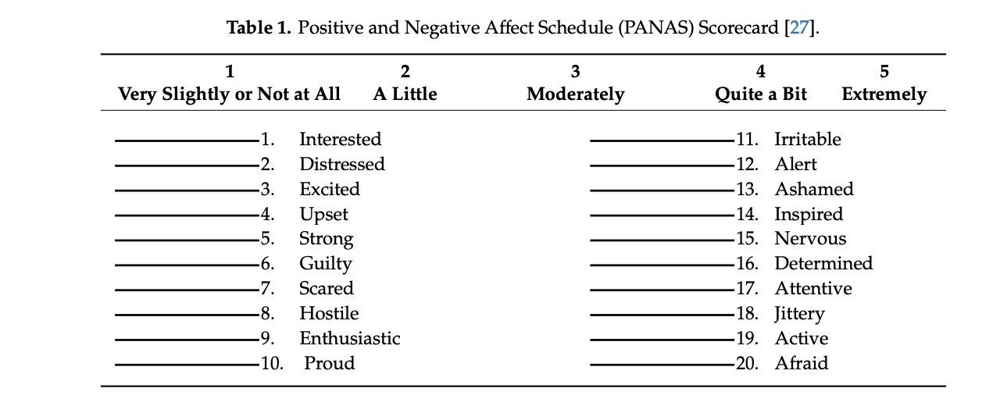
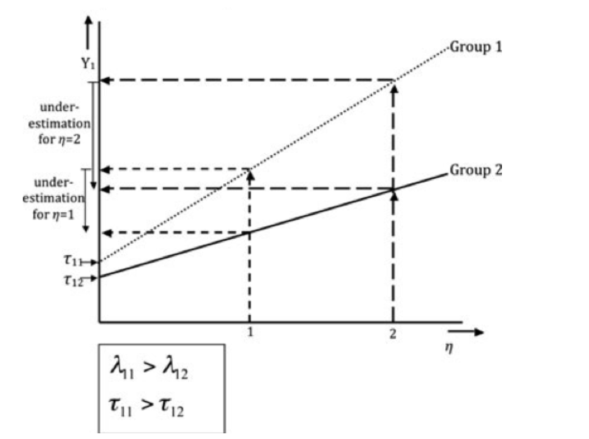
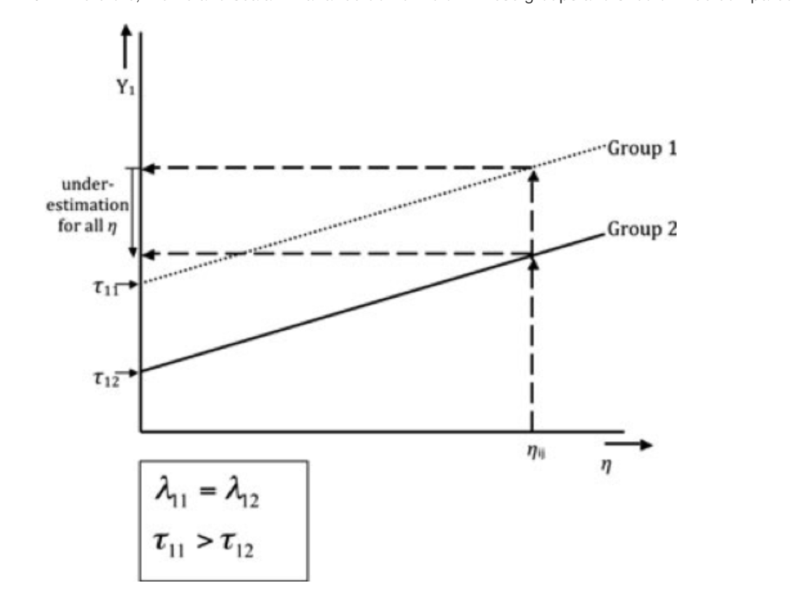
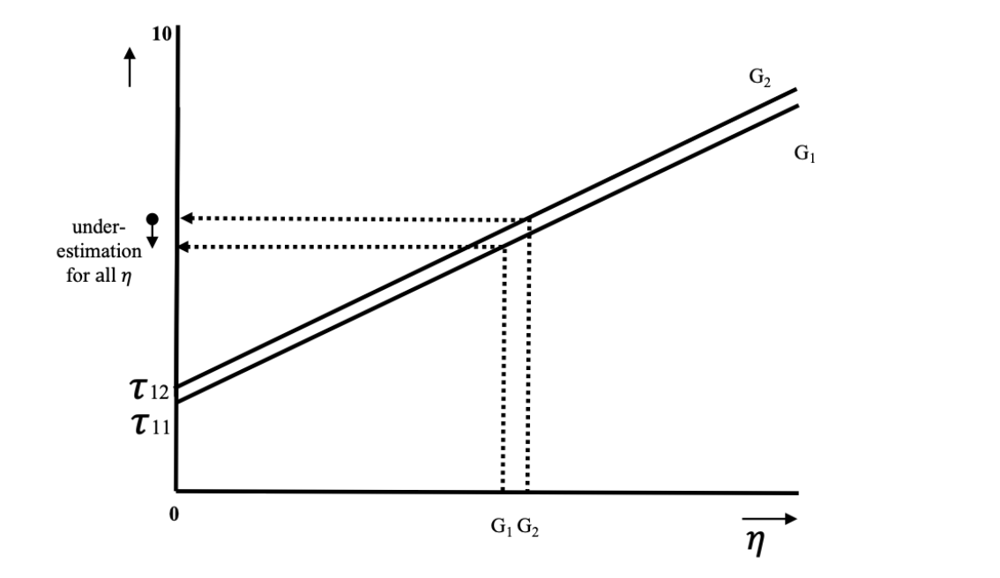

```{r setup, include=FALSE}
def.chunk.hook  <- knitr::knit_hooks$get("chunk")
knitr::knit_hooks$set(chunk = function(x, options) {
  x <- def.chunk.hook(x, options)
  paste0("\n \\", "tiny","\n\n", x, "\n\n \\normalsize")
})
```

```{r, include = FALSE}
library(here) 
library(haven)
library(lavaan)
library(tidyverse)
library(psych)
library(papaja)
## install package pinsearch if first time using this package
# install.packages("devtools")
# devtools::install_github("marklhc/pinsearch")
library(pinsearch)
```

# Outline

- Brief overview of measurement invariance (MI)
  
  - Definition of MI, measurement noninvariance, partial invariance
  
  - Importance of validating the MI assumption
  
  - Levels of MI
  
- Illustrative example
  
  - Investigate MI of the mini-IPIP (International Personality Item Pool) scale across gender.
  - Small Exercise
  
# Motivating Example

- The Positive and Negative Affect Schedule (PANAS) scale has been found to function differently for participants from different cultural backgrounds.


 
  - Are the observed differences in scale scores caused by real differences in negative affect or the different cultural meanings of scale items?

# What Is Measurement Invariance (MI)?

- Formal definition: 

- Implied meaning: Using the same questionnaire in different groups (such as countries or at various points in time, or under different conditions) does measure the same construct in the same way.

# What Is Measurement Noninvariance (MNI)?

- If there is a violation of MI => Measurement noninvariance/Item bias/Differential item functioning

  - The scale has different measurement properties across groups for individuals with the same latent construct level
  
  - E.g., Male consistently reported a higher score than female in mathmatics self-efficacy scale.

- If MI only holds for a subset of items => Partial invariance

# How To Test For MI?

- Multi-Group Confirmatory Factor Analysis (MGCFA) 
  
  - Likelihood ratio test to compare nested models, which means one model with equality constraints of a particular parameter and the other without such constraints.
  - E.g., the invariance of loadings can be tested by comparing the model with freely estimated loadings and the model with has equality constraints of loadings across groups

- Item Response Theory

# Multi-Group Confirmatory Factor Analysis (MGCFA) 

- CFA assumes the observed items load on a latent factor that represents the construct

- A single-factor MG-CFA

$$y_{ik} = \nu_k + \lambda_k\eta_{ik} + \epsilon_{ik}$$

  - $y_{ik}$ and $\eta_{ik}$ are the observed continuous response and the latent construct score for the $i$th person in the $k$th group

  - $\nu_k$ represents intercepts, $\lambda_k$ represents factor loadings, and the unique factor variables represents $\epsilon_{ik}$.

# Levels Of MI Testing

- Configural Invariance: the same model holds for all the groups

- Metric/Weak Invariance: factor loadings (slopes) are the same across the groups

- Scalar/Strong Invariance: intercepts and loadings are the same across the groups

- Strict Invariance: unique factor invariance, intercepts and loadings are the same across the groups

# Configural Invariance



# Metric Invariance



# Scalar Invariance



# Illustrative Example

- Goal: Examine measurement invariance of the mini-IPIP across gender.

- Data: Collected from 1994 Spring to 1996 Fall (Ock et al., 2020)

  - 564 participants (239 males, 325 females)
  
  - 20 items in total, four items per dimension (Agreeableness, Conscientiousness, Extraversion, Neuroticism, Openness to Experience)
  
  - 5-point Likert-type scale from 1 (*very inaccurate*) to 5 (*very accurate*).

# Model Specification
  
```{r}
data <- read.table(here::here("example", "IPIPFFM.dat"),
                   header = TRUE)%>%
  select("sex", "e1", "e4", "e6", "e7", "n1", "n2", "n6", "n8")
head(data)
```

```{r}
mod_n <- 'N =~ n1 + n2 + n6 + n8'
# check model fit
fit_n <- cfa(mod = mod_n, data = data)
# summary(fit_e, fit.measures = TRUE)
```

-----------------

```{r}
semPlot::semPaths(lavaanify(mod_n), rotation = 2, intercepts = TRUE)
```

# Testing Metric Invariance

- Metric Invariance add equality constraints on factor loadings across gender

- The Likelihood Ratio Test (LRT) suggests the metric invariance model has similar fit as the configural invariance model

```{r}
# fit configural invariance model
fit_con <- cfa(mod = mod_n, data = data, 
               group = "sex", std.lv = TRUE) 
# fit metric invariance model (loadings are constrained to be equal across groups)
fit_met <- cfa(mod = mod_n, data = data, group = "sex", 
               group.equal = "loadings", std.lv = TRUE)
# Likelihood Ratio Test
lavTestLRT(fit_con, fit_met)
```

# Testing Scalar Invariance

- Scalar Invariance add equality constraints on factor loadings and intercepts across groups

- The LRT suggests the scalar invariance model fit significantly worse than the metric invariance model

```{r}
# fit scalar invariance model
fit_sca <- cfa(mod = mod_n, data = data, group = "sex", 
               group.equal = c("loadings", "intercepts"), 
               std.lv = TRUE) 
# Likelihood Ratio test of scalar invairance model and metric invariance model
lavTestLRT(fit_met, fit_sca)
```

# Option 1: `pinSearch` Function From `pinsearch` Package

- This function automates the iterative search for noninvariant parameters 
(loadings, intercepts, residuals)

- Item `n1` has noninvariant intercepts across groups  

```{r}
res <- pinsearch::pinSearch(config_mod = mod_n, data = data, effect_size = TRUE,
                     group = "sex",  type = "intercepts")
res$`Non-Invariant Items`
```

# Option 2: Sequential MI Testing By Scale Items

- Manually searching for noninvariant parameters (loadings, intercepts, residuals)

- Find the item associated with the largest change in $\chi^2$ => item `n1`

```{r}
# fit scalar invariance model
fit_sca1 <- cfa(mod_n, data = data, group = "sex", 
                group.equal = c("loadings", "intercepts"), 
                group.partial = "n1 ~ 1", std.lv = TRUE) 
lavTestLRT(fit_sca1, fit_sca)
```

-----------------

```{r}
fit_sca2 <- cfa(mod_n, data = data, group = "sex", 
                group.equal = c("loadings", "intercepts"), 
                group.partial = "n2 ~1", std.lv = TRUE) 
lavTestLRT(fit_sca2, fit_sca)
```


```{r}
fit_sca6 <- cfa(mod_n, data = data, group = "sex", 
                group.equal = c("loadings", "intercepts"),
                group.partial = "n6 ~1", std.lv = TRUE) 
lavTestLRT(fit_sca6, fit_sca)
```

-----------------

```{r}
fit_sca8 <- cfa(mod_n, data = data, group = "sex", 
                group.equal = c("loadings", "intercepts"),
                group.partial = "n8 ~1", std.lv = TRUE) 
lavTestLRT(fit_sca8, fit_sca)
```

# Testing Strict Invariance

- The partial strict invariance model fit significantly worse than the partial scalar invariance model

```{r}
fit_str <- cfa(mod_n, data = data, group = "sex", 
                group.equal = c("loadings", "intercepts", "residuals"),
                group.partial = "n1 ~ 1", std.lv = TRUE) 
lavTestLRT(fit_sca1, fit_str)
```

# Testing Strict Invariance

- Items `n1`,`n2` has noninvariant unique factor variances across gender

- Effect size (Standardized mean difference) is 0.239

```{r}
res_str <- pinsearch::pinSearch(config_mod = mod_n, data = data, effect_size = TRUE,
                     group = "sex",  type = "residuals")
res_str$`Non-Invariant Items`
res_str$effect_size
```

# Partial Strict Invariance Model

- Conclusion: items `n6`, `n8` are strict invariant, item `n2` is strong/scalar invariant, item `n1` is weak/metric invariant 

- Final model: partial strict invariance model with freely estimated intercept for item `n1` and unique factor variances for items `n1` and `n2`.

```{r}
final_fit <- cfa(mod_n, data = data, group = "sex", 
                group.equal = c("loadings", "intercepts", "residuals"),
                group.partial = c("n1 ~ 1", "n1 ~~ n1", "n2 ~~ n2"), std.lv = TRUE) 
```

# Exercise time

Please complete the file "exercise.RMD". 

# Additional Topic:

- MI testing for categorical data

- Approximate invariance for many groups 

- Practical significance of MI
